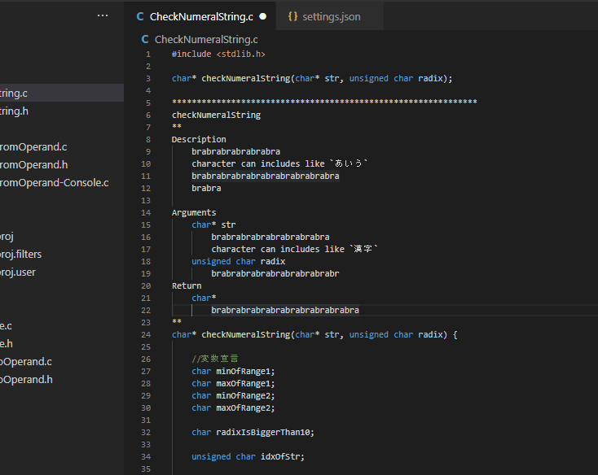
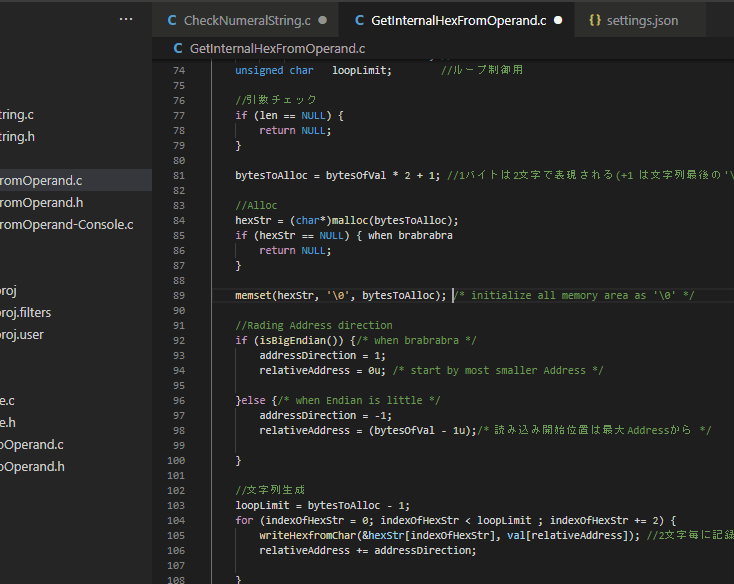

# Usage

Select the string and launch `Insistent Comments` from command palette.  

  

`Insistent Comments` aligns position of `/*` and `*/`.   
So you can use this extension like as below.  

  

# Settings

 - `insistentComments.spaceMargin`  
   Number of spaces right after `/*` and right before `*/`.  
   Default is `1`.    

 - `insistentComments.marginCharacterPredicting`  
   If `true` specified, a comment consisting of only consecutive symbols (this symbol is called "margin character" in this extension) is adjusted its length using that character.  
   If `false` specified, a comment is adjusted its length using ` `(space character).   
   Default is `true`.  
   e.g.  
   `/****/` is aligned like `/********/`  
   `/*==*/` is aligned like `/*======*/`

 - `InsistentComments.regexStrForMarginCharJudge`  
   Regular expression string to judge margin character or not.  
   Default is `[\\x21-\\x2F\\x3A-\\x40\\x5B-\\x60\\x7B-\\x7E]`  

